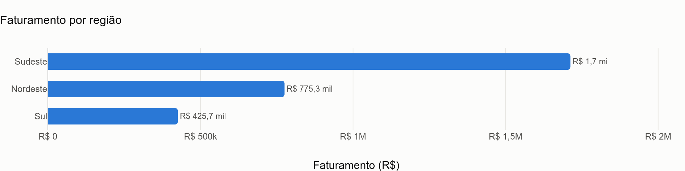
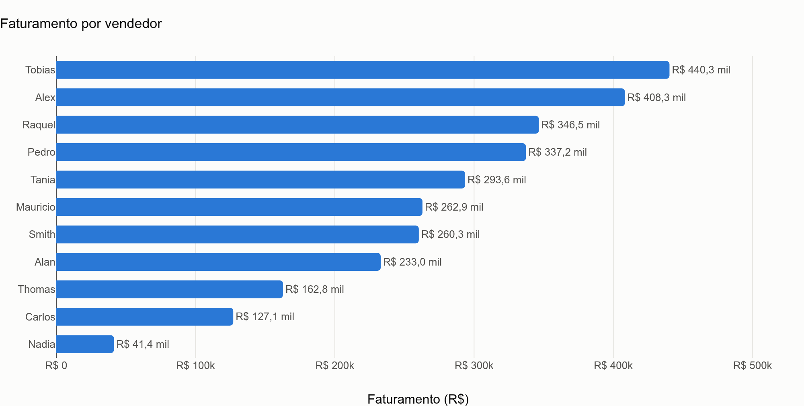
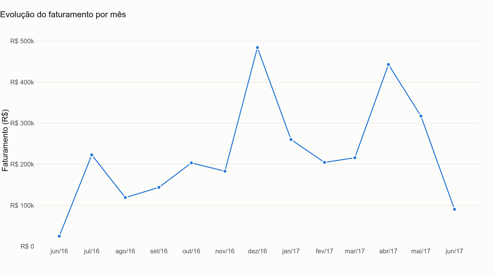
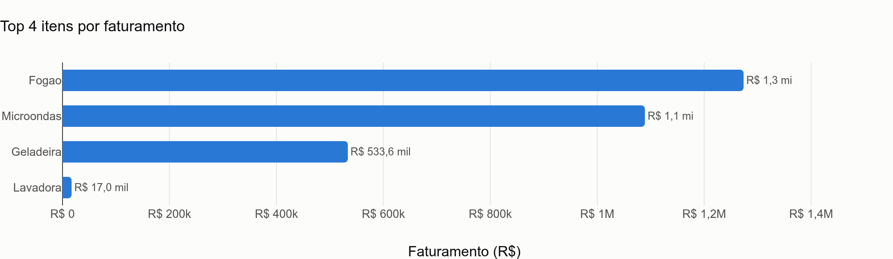

# Análise de Pedidos

Pipeline de análise de vendas em Python: lê um CSV de pedidos, calcula as
agregações de negócio e entrega o resultado de duas formas — um **relatório
HTML único** para enviar ao cliente e um **painel Dash** com filtros para
explorar os dados ao vivo.

O projeto é organizado em **camadas independentes** — carga, análise,
visualização e entrega — com dois orquestradores que as conectam. Cada camada
tem uma responsabilidade única e não conhece as outras:

```
Data/Pedidos.csv
       │
       ▼
 src/carga.py      → lê o CSV, tipa as colunas e cria a coluna Total
       │
       ▼
 src/analise.py    → agrega (DataFrame → DataFrame), sem ler arquivo nem plotar
       │
       ▼
 src/graficos.py   → monta as Figures do Plotly, sem agregar nem salvar
       │
       ▼
 src/relatorio.py  → declara o catálogo e monta a página HTML, sem gravar nada
       │
       ├──────────────┬───────────────────────────────────────────────────────
       ▼              ▼
 main.py          app.py
 (modo arquivo)   (modo servidor)
 grava Saida/     serve em localhost com filtros de período, região e vendedor
                  e exporta o relatório já filtrado
```

Os dois orquestradores leem o **mesmo catálogo** (`RELATORIOS`, em
`src/relatorio.py`): acrescentar um gráfico é acrescentar uma linha nessa
lista — e ele passa a aparecer nos dois.

---

## Estrutura do projeto

```
Pedidos/
├── Data/
│   └── Pedidos.csv
├── src/
│   ├── __init__.py
│   ├── carga.py
│   ├── analise.py
│   ├── graficos.py
│   └── relatorio.py
├── assets/
│   └── estilo.css          (carregado automaticamente pelo Dash)
├── Saida/                  (gerado ao executar)
│   ├── relatorio.html      (entregável consolidado — fora do versionamento)
│   ├── *.html              (um por gráfico — fora do versionamento)
│   └── img/
│       ├── vendas_por_regiao.png
│       ├── vendas_por_vendedor.png
│       ├── vendas_por_mes.png
│       └── top_itens.png
├── main.py
├── app.py
├── requirements.txt
├── .gitignore
└── README.md
```

### Diretórios

| Diretório | O que guarda |
|---|---|
| `Data/` | Dados de entrada (dataset bruto). Nada aqui é modificado pelo pipeline — a leitura é sempre somente leitura. |
| `src/` | Pacote Python com a lógica do projeto, dividida em camadas. Nenhum módulo aqui é executado diretamente. |
| `assets/` | Convenção do Dash: tudo que está aqui é servido automaticamente pelo `app.py`, sem precisar registrar nada no código. Guarda o CSS do painel. |
| `Saida/` | Artefatos gerados pela execução. Criado automaticamente pelo `main.py`. Os HTML interativos são **ignorados pelo Git** (~4,8 MB cada, com o `plotly.js` embutido) — o repositório guarda o código que gera o resultado, não o resultado. |
| `Saida/img/` | Exceção à regra acima: os PNG estáticos (~500 KB no total) **ficam versionados**, para que os gráficos apareçam neste README sem que ninguém precise executar o projeto. |

### Arquivos

| Arquivo | Papel |
|---|---|
| `main.py` | **Ponto de entrada em modo arquivo.** Orquestra o fluxo: carrega → agrega → plota → grava. É o único arquivo que decide o destino das figuras: `relatorio.html` consolidado, um HTML por gráfico, PNG em `Saida/img/` e/ou abrir no navegador. |
| `app.py` | **Ponto de entrada em modo servidor.** Painel Dash com filtros de período, região e vendedor aplicados a todos os gráficos de uma vez, mais um botão que exporta o `relatorio.html` **já com o recorte selecionado**. Reusa as mesmas camadas do `main.py`, sem duplicar regra de negócio. Expõe `server` para hospedagem via WSGI. |
| `src/__init__.py` | Marca `src/` como pacote Python, permitindo `from src import analise, graficos`. |
| `src/carga.py` | **Camada de carga.** Função `carregar_pedidos()`: valida a existência do arquivo, lê o CSV, converte `DataPedido` para `datetime` e cria a coluna derivada `Total` (`Unidades × PrecoUnidade`). Aceita um caminho opcional, o que permite apontar para outro CSV (recorte, arquivo de teste) sem alterar o módulo. |
| `src/analise.py` | **Camada de análise.** Quatro funções puras que recebem o DataFrame e devolvem uma agregação: `vendas_por_regiao()`, `vendas_por_vendedor()`, `vendas_por_mes()` e `top_itens(n=5)`. Nenhuma delas lê arquivo nem desenha gráfico. |
| `src/relatorio.py` | **Camada de entrega.** Duas coisas: o catálogo `RELATORIOS` — a fonte única sobre o que entra na entrega, em que ordem e com que texto de leitura — e `montar_relatorio()`, que junta os gráficos, os KPIs e o cabeçalho em uma página HTML autocontida. Devolve a string; quem grava é quem chamou. `construir(df)` roda o catálogo inteiro sobre qualquer recorte do DataFrame. |
| `src/graficos.py` | **Camada de visualização.** Uma função por gráfico, cada uma recebendo um DataFrame já agregado e devolvendo uma `Figure` do Plotly. Define o template visual compartilhado (`pedidos`): paleta, tipografia, grade discreta e separadores no padrão brasileiro (vírgula decimal). Define também a geometria das barras — `ESPESSURA_BARRA` e `PASSO_CATEGORIA`, em pixels — de onde saem o `bargap` e a altura de cada figura. Helpers internos cuidam de rótulos de mês em português (`jun/16`) e valores curtos em reais (`R$ 24,5 mil`). |
| `requirements.txt` | Dependências do projeto: `pandas`, `plotly`, `kaleido` e `dash`. |
| `.gitignore` | Mantém fora do repositório o ambiente virtual (`.venv/`), configurações da IDE (`.idea/`), caches (`__pycache__/`) e os HTML gerados (`Saida/*`), abrindo exceção para os PNG do README (`!Saida/img/`). |

---

## Dados

`Data/Pedidos.csv` — 43 pedidos de eletrodomésticos entre **jun/2016 e jun/2017**.

| Coluna | Tipo | Descrição |
|---|---|---|
| `DataPedido` | texto → `datetime` | Data do pedido, no formato `7-Jun-2016`. Convertida na carga. |
| `Regiao` | texto | Nordeste, Sudeste ou Sul. |
| `Estado` | texto | Unidade federativa do pedido (13 estados). |
| `Vendedor` | texto | Responsável pela venda (11 vendedores). |
| `Item` | texto | Fogão, Geladeira, Lavadora ou Microondas. |
| `Unidades` | inteiro | Quantidade vendida. |
| `PrecoUnidade` | decimal | Preço unitário em reais. |
| `Total` | decimal | **Coluna derivada** (`Unidades × PrecoUnidade`), criada em `src/carga.py`. |

---

## Relatórios gerados

| Arquivo em `Saida/` | Gráfico | Leitura |
|---|---|---|
| `relatorio.html` | **Os quatro juntos** | O entregável: cabeçalho com o período, faturamento total em destaque, quatro KPIs de apoio e os gráficos com uma nota de leitura cada. |
| `vendas_por_regiao.html` | Barras horizontais | Faturamento por região, do maior para o menor. |
| `vendas_por_vendedor.html` | Barras horizontais | Faturamento por vendedor; o hover mostra também a quantidade de pedidos. Nomes longos leem melhor deitados. |
| `vendas_por_mes.html` | Linha com marcadores | Evolução mensal do faturamento, com crosshair unificado no eixo x. |
| `top_itens.html` | Barras horizontais | Ranking dos itens que mais faturaram. |

Os HTML são autocontidos — o `plotly.js` fica embutido no arquivo, então
basta abrir no navegador: sem servidor e sem internet. No `relatorio.html` o
`plotly.js` entra **uma vez só**, e não uma vez por gráfico: por isso o
relatório inteiro pesa ~4,9 MB, praticamente o mesmo que um gráfico avulso
(contra ~19 MB se os quatro fossem enviados separados). Cada execução grava
também uma versão estática em `Saida/img/`, usada abaixo.

### Faturamento por região



### Faturamento por vendedor



### Evolução do faturamento por mês



### Top itens por faturamento



---

## Como executar

```bash
# 1. Ambiente virtual
python3 -m venv .venv
source .venv/bin/activate        # Windows: .venv\Scripts\activate

# 2. Dependências
pip install -r requirements.txt

# 3. Pipeline completo (gera os arquivos em Saida/)
python main.py

# 4. Painel interativo (abre em http://127.0.0.1:8050)
python app.py
```

A execução imprime cada agregação no terminal, grava o `relatorio.html`, os
quatro HTML avulsos em `Saida/` e os quatro PNG em `Saida/img/` (~7 s no
total). Três interruptores no final do `main.py` controlam o comportamento:

| Parâmetro | Padrão | Efeito |
|---|---|---|
| `exibir` | `True` | Abre o `relatorio.html` no navegador ao final — uma aba com o projeto inteiro. Use `False` para apenas gravar os arquivos. |
| `gerar_png` | `True` | Exporta os PNG via `kaleido`. Use `False` para uma execução mais rápida, só com os HTML. |
| `cliente` | `None` | Nome do destinatário. Preenchido, escreve “Preparado para X” no cabeçalho do relatório. |

A exportação de PNG depende do `kaleido`, que usa um Chrome headless. Se ele
não estiver disponível na máquina, o `main.py` avisa no terminal e segue — os
HTML, que são o resultado principal, são gerados do mesmo jeito.

**Requisitos:** Python 3.10+ (o código usa a sintaxe `Path | None`).
Desenvolvido em Python 3.14.

---

## Como compartilhar o resultado

| Situação | O que enviar | Como |
|---|---|---|
| **Enviar por e-mail ou mensagem** | `Saida/relatorio.html` | Um anexo só, ~4,9 MB. O cliente dá duplo clique e abre no navegador — interativo, offline, sem instalar nada. |
| **Recorte específico** (uma região, um trimestre, um vendedor) | `relatorio.html` exportado do painel | Suba o `app.py`, aplique os filtros e clique em **Baixar relatório**. O arquivo sai com o recorte já aplicado e os KPIs recalculados. |
| **Cliente que arquiva ou imprime** | PDF | Abra o `relatorio.html` e imprima em “Salvar como PDF”. O CSS de impressão já evita que um gráfico seja cortado entre páginas. |
| **Apresentar ao vivo** | O painel Dash | `python app.py` e compartilhe a tela; os filtros respondem na hora. |
| **Link fixo, sempre atualizado** | O painel hospedado | O `app.py` expõe `server` (WSGI), então roda em Render, Railway, Fly.io ou qualquer serviço com `gunicorn app:server`. |

**Atenção ao publicar:** o painel hospedado e o GitHub Pages são públicos por
padrão. Se os dados forem sigilosos, fique no anexo ou no PDF — ou coloque
autenticação antes de expor a URL.

---

## Decisões de projeto

- **Separação por camadas.** Análise não sabe de onde vêm os dados; gráficos
  não sabem como os números foram calculados. Trocar a fonte (CSV → banco)
  mexe em um arquivo só.
- **Funções que devolvem, não que imprimem.** As camadas retornam DataFrames e
  Figures; só o `main.py` decide o que fazer com eles. Isso torna cada função
  testável e reutilizável.
- **Caminhos com `pathlib`.** Todos os caminhos partem de `Path(__file__).parent`,
  então o projeto roda de qualquer diretório e em qualquer sistema operacional.
- **Formatação brasileira.** Vírgula decimal, meses em português e valores
  abreviados em reais — o gráfico é lido por quem fala português.
- **PNG versionado, HTML não.** O interativo é o entregável, mas pesa 4,8 MB
  por arquivo e pode ser regerado a qualquer momento; o estático é leve e
  documenta o resultado direto neste README.
- **Um catálogo, dois orquestradores.** `main.py` e `app.py` não repetem a
  lista de gráficos: ambos leem `RELATORIOS` de `src/relatorio.py`. Sem isso,
  todo gráfico novo precisaria ser cadastrado em dois lugares — e um dia os
  dois divergiriam.
- **Dash não substitui o relatório.** O painel é um servidor: só existe
  enquanto está rodando, e por isso não se anexa a um e-mail. O HTML é o que
  se entrega; o Dash é onde se explora e de onde o HTML sai filtrado.
- **`plotly.js` embutido uma vez.** No relatório consolidado o bundle entra
  só na primeira figura (`include_plotlyjs` ligado apenas nela). É o que
  transforma 19 MB em 4,9 MB sem perder a leitura offline.
- **Espessura de barra em pixels, não no olho.** O Plotly só aceita `bargap`
  (a fração vazia de cada faixa), então a barra engorda sozinha quando há
  poucas categorias. Fixando faixa (40px) e espessura (24px), o `bargap` vira
  conta e a altura da figura passa a derivar da contagem de barras.
- **Três gráficos de barra, todos deitados.** O de região era vertical, mas
  com três categorias cada barra recebia uma faixa de ~270px e ficava fina no
  meio do vazio. Na horizontal a faixa depende da altura, que o próprio
  gráfico define — a mesma regra vale para os três, sem exceção.
- **Sem legenda nos gráficos.** Todas as séries são únicas: o título já diz o
  que está sendo medido, e a legenda seria ruído.

---

## Autor

**Cristian Matias de Souza** — Analista de Dados
